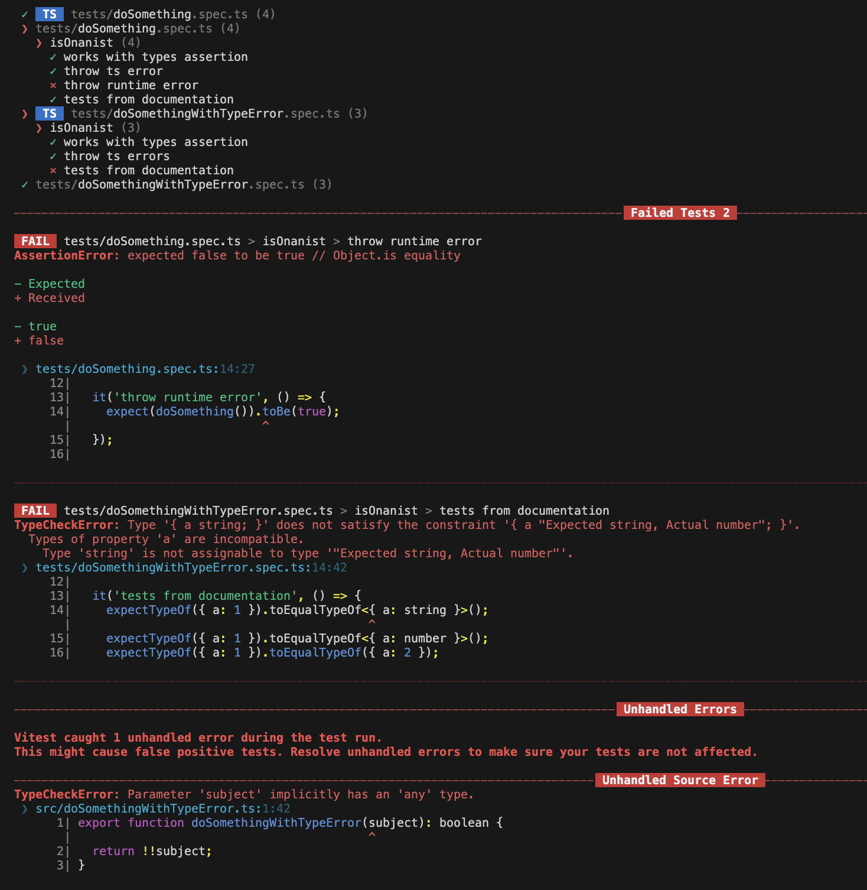

# Vitest typechecking playground

## Setup information

| Path                            | Has type error is source file | Has type error inside test file |
| ------------------------------- | ----------------------------- | ------------------------------- |
| src/doSomething                 | ❌                            | ✅                              |
| src/doSomethingWithTypeError.ts | ✅                            | ❌                              |

From `vitest` 2.1 the workspace workaround should no longer be necessary:

From [Testing types documentation](https://vitest.dev/guide/testing-types.html#testing-types)

> Before Vitest 2.1, your typecheck.include overrode the include pattern,
> so your runtime tests did not actually run; they were only type-checked.
>
> Since Vitest 2.1, if your include and typecheck.include overlap,
> Vitest will report type tests and runtime tests as separate entries.



> [!CAUTION]
>
> BELOW CONTENT IS NO LONGER VALID

Finding a way to perform typecheck on vitest using [--typecheck flag](https://vitest.dev/guide/testing-types.html#run-typechecking):

## Learned things

### How to get typechecking on both tests and source files

Include:

```js
  test: {
    typecheck: {
      tsconfig: './tsconfig.test.json',
      include: ['**/tests/**/*.spec.ts(x)?'],
    },
  },
```

in `vite.config.js``

- <https://github.com/vitest-dev/vitest/issues/4767>

### Can't run js and ts check at the same time

When running with typecheck vitest doesn't perform runtime check and vice versa.

To solve the issue I used 2 separate workspaces:


The result is what you see in the next image:


